# R Project {style="text-align: center"}

#### Wojciech Kaźmierczak, Marcin Serafin {style="text-align: center"}

Projekt przedstawia opracowanie statystyczne wyników porównania działania algorytmów **PRS** (Pure-Random Search) i **GA** (Genetic Algorithm) minimalizacji stochastycznej za pomocą funckji **Ackleya** i **Rosenbrocka** w języku **R**.

## PRS {style="text-align: center"}

Pure random Search jest algorytmem przeszukiwania oparty o losowe niezależnie pobieranie danej ilości punktów (n) z dziedziny. Następnie oblicza wartość funkcji w tych punktach szukając najmniejszej wartości.

```{r}
PRS <- function(f, dim, n){
  min_value <- Inf
  
  for(i in 1:n){
    point <- runif(dim, getLowerBoxConstraints(f), getUpperBoxConstraints(f))
    value <- f(point)
    
    if(value < min_value){
      min_value <- value
    }
  }
  
  return(min_value)
}

```

## GA {style="text-align: center"}

Algorytm Genetyczny to także algorytm przeszukiwania (a raczej tutaj tak go wykorzystujemy), jest on natomiast oparty o selekcje naturalną w rzeczywistym świecie.

```{r}
GA <- function(min_func){
  return(ecr(min_func, lower = getLowerBoxConstraints(min_func),
      upper = getUpperBoxConstraints(min_func), minimize =TRUE,
      representation = "float", mu = 50L, lambda = 25L,
      terminators = list(stopOnIters(1000L)),
      mutator = setup(mutGauss, lower = getLowerBoxConstraints(min_func),
      upper = getUpperBoxConstraints(min_func)))$best.y)
}

```

## Funkcja Ackley'a {style="text-align: center"}

Jest ona funkcją niewypukłą używaną jako problem testowy dla algorytmów optymalizacyjnych opracowaną w doktoracie Davida Ackley'a w 1987 roku.

Jej wzór dla dwóch wymiarów prezentuje sie nasępująco:

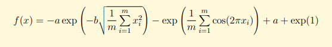

a wykres:

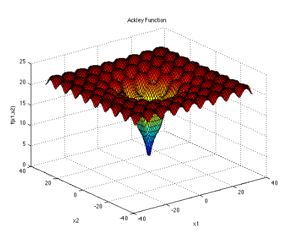

Natomiast my posługiwać będziemy sie wbudowaną w R funkcją makeAckleyFunction

## Funckja Rosenbrock'a {style="text-align: center"}

Jest ona takżę funkcją niewypukłą, wprowadzoną przez Howarda H. Rosenbrocka w 1960 roku, która jest używana jako problem testowy dla algorytmów optymalizacyjnych.[1] Znana jest również jako dolina Rosenbrocka lub funkcja bananowa Rosenbrocka.

Globalne minimum znajduje się wewnątrz długiej, wąskiej, płaskiej doliny o parabolicznym kształcie. Znalezienie doliny jest trywialne. Zbieżność do globalnego minimum jest jednak trudna.

Podstawowo definiowana jest jako

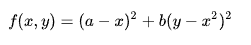

gdzie globalne minimum znajdue sie w $(x,y)=(a,a^2)$ gdzie $f(x,y)=0$

Jednak jej wzór dla dwóch wymiarów prezentuje sie nasępująco:

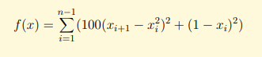

a wykres:

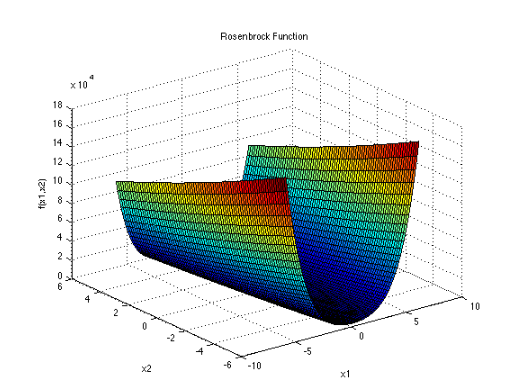

Natomiast my posługiwać będziemy sie wbudowaną w R funkcją makeRosenbrockFunction

## Porównywanie {style="text-align: center"}

Za pomocą podanych wcześnie metod wyszukujemy minima dla funkcji Ackleya i Rosenbrocka i n=1000 ( tutaj nazwane budżetem) Następnie porównujemy je w wymiarach 2,10 i 20 szukając w nich średnich wyników poprzez wykonanie nie mniej niż 50 wywołań każdej.

```{r}
compare_algorithms <- function(f, dim){
  f1<-f(dim)
  PRS_RES <- replicate(50,PRS(f1,dim, 1000))
  GA_RES <- replicate(50, GA(f1))
  return(list(PRS_RES,GA_RES))
}

```

## Histogramy

### Ackley

-   PRS 2 wymiary

    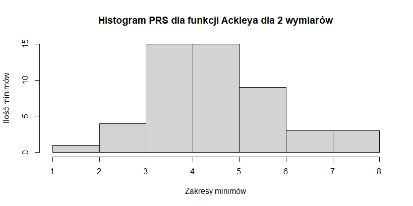

-   PRS 10 wymiarów

    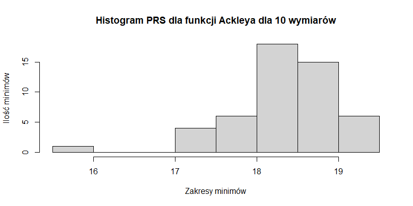

-   PRS 20 wymiarów

    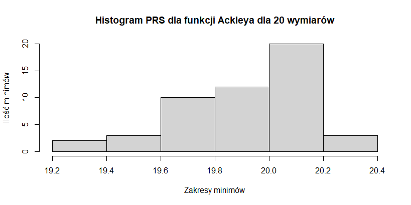

-   GA 2 wymiary

    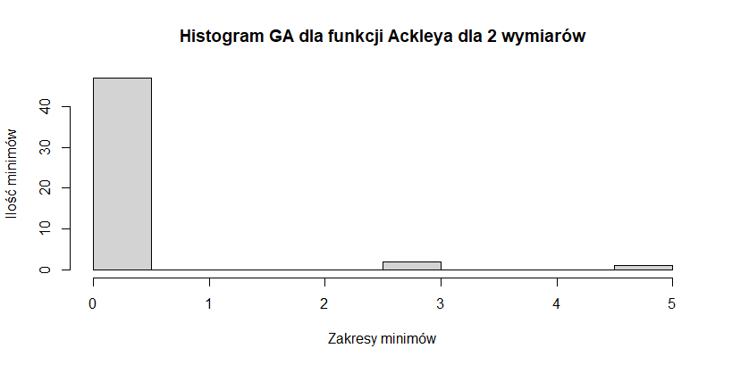

-   GA 10 wymiarów

    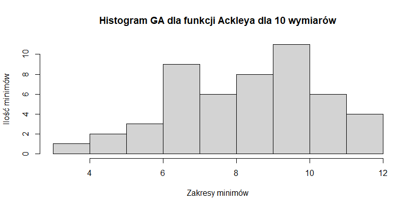

-   GA 20 wymiarów

    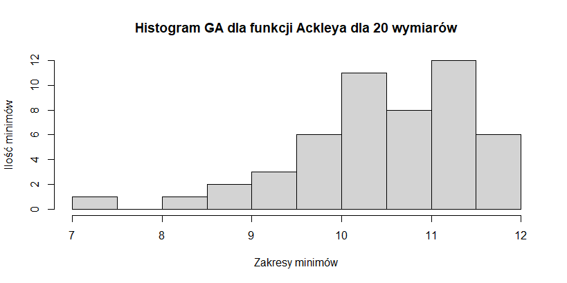

### Rosenbrock

-   PRS 2 wymiary

    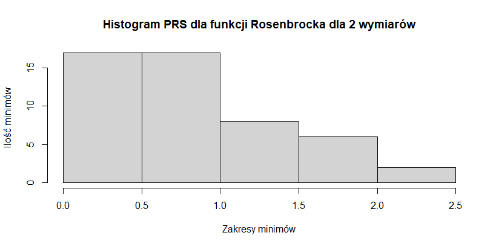

-   PRS 10 wymiarów

    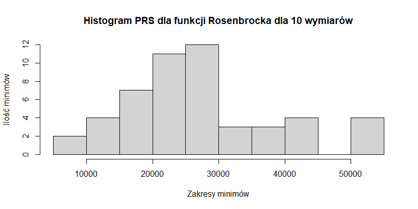

-   PRS 20 wymiarów

    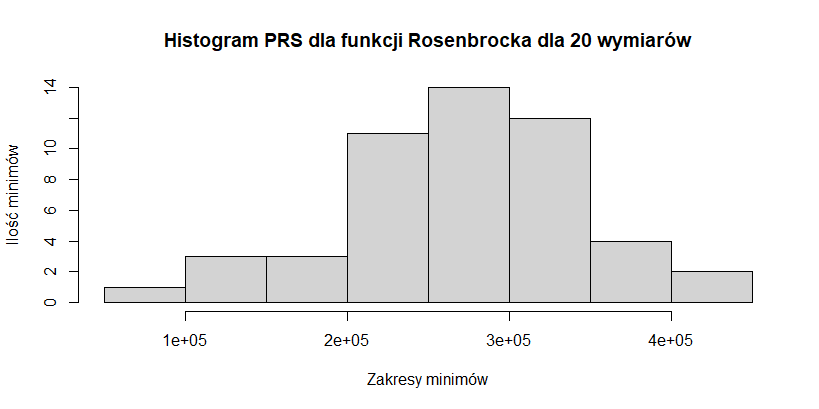

-   GA 2 wymiary

    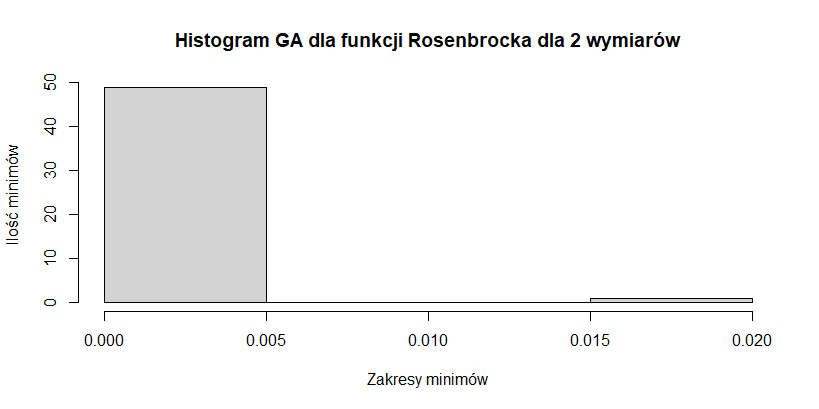

-   GA 10 wymiarów

    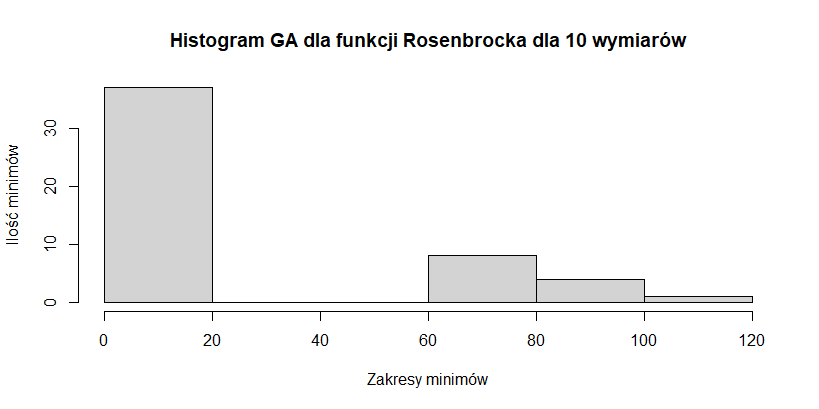

-   GA 20 wymiarów

    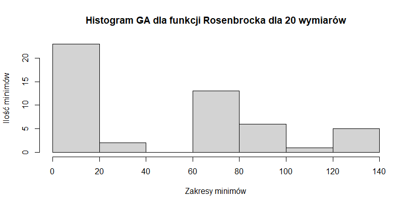

## Wykresy

-   Porównanie dla Ackleya

    2 wymiary

    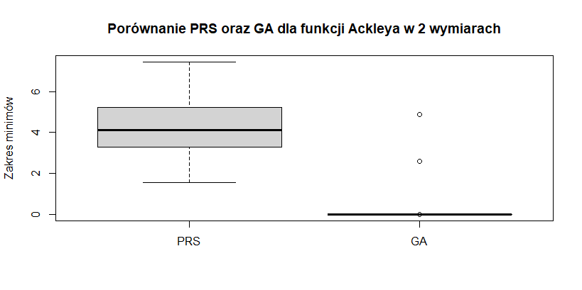

    ```         
    Wartości dla algorytmu genetycznego są bardziej skupione w jednym miejscu oraz niemal wszystkie leżą w okolicach zera, wyniki odpowiadają intuicji, gdyż dla niektórych wartości funkcja poruszająca się po gradiencie utknie w minimach lokalnych, jednak znaczna część punktów schodząc sukcesywnie po wartościach w dół trafi do minimum globalnego, którym jest 0. Algorytm PRS mając do dyspozycji jedynie losowe wartości odnajduje więcej minimów lokalnych.
    ```

    10 wymiarów

    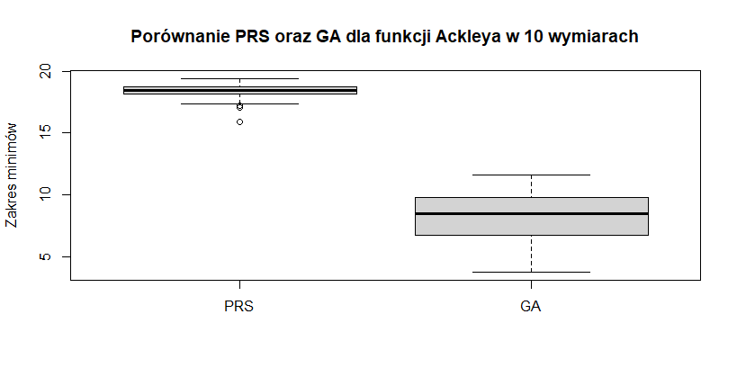

    ```         
    Tendencja odległości wartości od zera jest zachowana mianowicie wartości uzyskane algorytmem genetycznym są rozmieszczone bliżej zera.
    ```

    20 wymiarów

    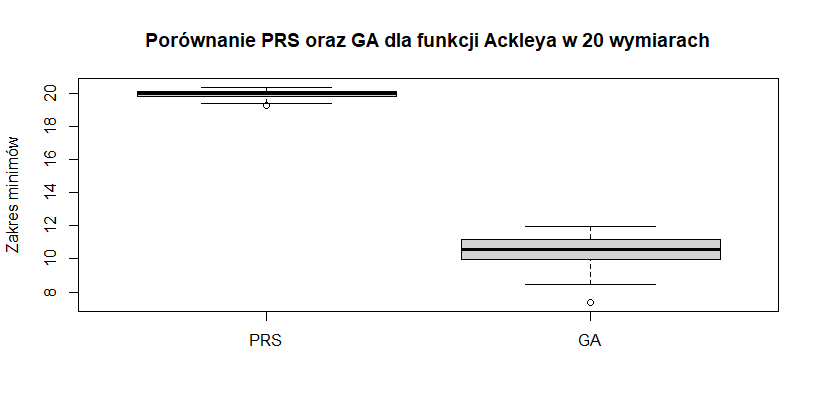

    ```         
    Tendencja odległości wartości od zera ponownie jest zachowana mianowicie wartości uzyskane algorytmem genetycznym są rozmieszczone bliżej zera.
    ```

-   Porównanie dla Rosenbrocka

    2 wymiary

    

    ```         
    Podobnie jak dla funkcji Ackley'a w dwóch wymiarach, algorytm genetyczny daje wartości znacznie bardziej zbliżone wartości zero, jednak tym razem bez wartosci odstających, spowodowane jest to zapewne gęstoscią rozmieszczenia minimów lokalnych
    ```

    10 wymiarów

    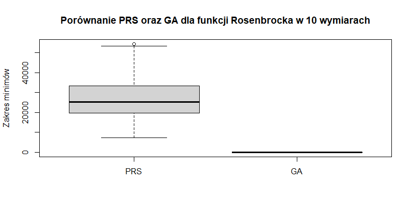

    ```         
    Wykres jest podobny do tego z przypadku 2 wymiarowego,a za to całkiem inny od wykresu dla funkcji Ackley'a dla 10 wymiarów.
    ```

    20 wymiarów

    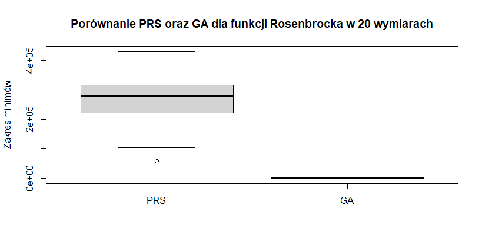

    ```         
    Sytuacja analogiczna jak dla mniejszych wymiarów
    ```

## Testy

### Ackley

```         
Hipotezą zerową dla One-Sample t-testów jest stwierdzenie że średnia jest równa 0.
Natomiast hipotezą zerową dla Welch Two Sample t-testów jest stwierdzenie, że różnica średnich jest równa 0.
Hipotezy alternatywne w obu przypadkach są przypadkiem przeciwnym to znaczy średnia nie jest równa 0 dla pierwszego ww testu oraz różnica średnich nie jest równa 0 dla drugiego ww testu.
```

-   2 Wymiary PRS

    ```         
        One Sample t-test

    data:  results[[i]][[1]]
    t = 23.769, df = 49, p-value < 2.2e-16
    alternative hypothesis: true mean is not equal to 0
    95 percent confidence interval:
     3.964875 4.697213
    sample estimates:
    mean of x 
     4.331044
    ```

    ```         
    p-value jest mniejsze od 0.05 zatem hipoteza zerowa została odrzucona
    Przedziałem ufności jest przedział: [3.964875, 4.697213]
    ```

    GA

    ```         
        One Sample t-test

    data:  results[[i]][[2]]
    t = 1.6825, df = 49, p-value = 0.09883
    alternative hypothesis: true mean is not equal to 0
    95 percent confidence interval:
     -0.03916893  0.44214642
    sample estimates:
    mean of x 
    0.2014887 
    ```

    ```         
    p-value jest większe od 0.05 zatem hipoteza zerowa nie została odrzucona
    Przedziałem ufności jest przedział: [-0.03916893,  0.44214642]
    ```

    GA i PRS

    ```         
        Welch Two Sample t-test

    data:  results[[i]][[2]] and results[[i]][[1]]
    t = -18.939, df = 84.675, p-value < 2.2e-16
    alternative hypothesis: true difference in means is not equal to 0
    95 percent confidence interval:
     -4.563107 -3.696004
    sample estimates:
    mean of x mean of y 
    0.2014887 4.3310440
    ```

    ```         
    p-value jest mniejsze od 0.05 zatem hipoteza zerowa została odrzucona
    Przedziałem ufności jest przedział: [-4.563107, -3.696004]
    ```

-   10 wymiarów PRS

    ```         
         One Sample t-test

    data:  results[[i]][[1]]
    t = 202.22, df = 49, p-value < 2.2e-16
    alternative hypothesis: true mean is not equal to 0
    95 percent confidence interval:
     18.18751 18.55261
    sample estimates:
    mean of x 
     18.37006 
    ```

    ```         
    p-value jest mniejsze od 0.05 zatem hipoteza zerowa została odrzucona
    Przedziałem ufności jest przedział: [18.18751, 18.55261]
    ```

    GA

    ```         
         One Sample t-test

    data:  results[[i]][[2]]
    t = 30.513, df = 49, p-value < 2.2e-16
    alternative hypothesis: true mean is not equal to 0
    95 percent confidence interval:
     7.672420 8.754287
    sample estimates:
    mean of x 
     8.213354 
    ```

    ```         
    p-value jest mniejsze od 0.05 zatem hipoteza zerowa została odrzucona
    Przedziałem ufności jest przedział: [7.672420, 8.754287]
    ```

    GA i PRS

    ```         
         Welch Two Sample t-test

    data:  results[[i]][[2]] and results[[i]][[1]]
    t = -35.751, df = 60.018, p-value < 2.2e-16
    alternative hypothesis: true difference in means is not equal to 0
    95 percent confidence interval:
     -10.724969  -9.588436
    sample estimates:
    mean of x mean of y 
     8.213354 18.370056 
    ```

    ```         
    p-value jest mniejsze od 0.05 zatem hipoteza zerowa została odrzucona
    Przedziałem ufności jest przedział: [-10.724969,  -9.588436]
    ```

-   20 wymiarów PRS

    ```         
         One Sample t-test

    data:  results[[i]][[1]]
    t = 585.61, df = 49, p-value < 2.2e-16
    alternative hypothesis: true mean is not equal to 0
    95 percent confidence interval:
     19.84591 19.98259
    sample estimates:
    mean of x 
     19.91425 
    ```

    ```         
    p-value jest mniejsze od 0.05 zatem hipoteza zerowa została odrzucona
    Przedziałem ufności jest przedział: [19.84591, 19.98259]
    ```

    GA

    ```         
         One Sample t-test

    data:  results[[i]][[2]]
    t = 75.776, df = 49, p-value < 2.2e-16
    alternative hypothesis: true mean is not equal to 0
    95 percent confidence interval:
     10.17740 10.73191
    sample estimates:
    mean of x 
     10.45466
    ```

    ```         
    p-value jest mniejsze od 0.05 zatem hipoteza zerowa została odrzucona
    Przedziałem ufności jest przedział: [10.17740, 10.73191]
    ```

    GA i PRS

    ```         
         Welch Two Sample t-test

    data:  results[[i]][[2]] and results[[i]][[1]]
    t = -66.572, df = 54.932, p-value < 2.2e-16
    alternative hypothesis: true difference in means is not equal to 0
    95 percent confidence interval:
     -9.744371 -9.174820
    sample estimates:
    mean of x mean of y 
     10.45466  19.91425
    ```

    ```         
    p-value jest mniejsze od 0.05 zatem hipoteza zerowa została odrzucona
    Przedziałem ufności jest przedział: [-9.744371, -9.174820]
    ```

### Rosenbrock

-   2 Wymiary PRS

    ```         
            One Sample t-test

    data:  results[[i]][[1]]
    t = 10.059, df = 49, p-value = 1.656e-13
    alternative hypothesis: true mean is not equal to 0
    95 percent confidence interval:
     0.6483088 0.9720170
    sample estimates:
    mean of x 
    0.8101629 
    ```

    ```         
    p-value jest mniejsze od 0.05 zatem hipoteza zerowa została odrzucona
    Przedziałem ufności jest przedział: [0.6483088, 0.9720170]
    ```

    GA

    ```         
        One Sample t-test

    data:  results[[i]][[2]]
    t = 1.2276, df = 49, p-value = 0.2255
    alternative hypothesis: true mean is not equal to 0
    95 percent confidence interval:
     -0.0003182545  0.0013175466
    sample estimates:
       mean of x 
    0.0004996461 
    ```

    ```         
    p-value jest większe od 0.05 zatem hipoteza zerowa nie została odrzucona
    Przedziałem ufności jest przedział: [-0.0003182545,  0.0013175466]
    ```

    GA i PRS

    ```         
        Welch Two Sample t-test

    data:  results[[i]][[2]] and results[[i]][[1]]
    t = -10.053, df = 49.003, p-value = 1.69e-13
    alternative hypothesis: true difference in means is not equal to 0
    95 percent confidence interval:
     -0.9715192 -0.6478073
    sample estimates:
       mean of x    mean of y 
    0.0004996461 0.8101628757 
    ```

    ```         
    p-value jest mniejsze od 0.05 zatem hipoteza zerowa została odrzucona
    Przedziałem ufności jest przedział: [-0.9715192, -0.6478073]
    ```

-   10 wymiarów PRS

    ```         
         One Sample t-test

    data:  results[[i]][[1]]
    t = 16.691, df = 49, p-value < 2.2e-16
    alternative hypothesis: true mean is not equal to 0
    95 percent confidence interval:
     24085.65 30679.37
    sample estimates:
    mean of x 
     27382.51 
    ```

    ```         
    p-value jest mniejsze od 0.05 zatem hipoteza zerowa została odrzucona
    Przedziałem ufności jest przedział: [24085.65, 30679.37]
    ```

    GA

    ```         
         One Sample t-test

    data:  results[[i]][[2]]
    t = 4.8706, df = 49, p-value = 1.204e-05
    alternative hypothesis: true mean is not equal to 0
    95 percent confidence interval:
     13.82585 33.24803
    sample estimates:
    mean of x 
     23.53694
    ```

    ```         
    p-value jest mniejsze od 0.05 zatem hipoteza zerowa została odrzucona
    Przedziałem ufności jest przedział: [13.82585, 33.24803]
    ```

    GA i PRS

    ```         
         Welch Two Sample t-test

    data:  results[[i]][[2]] and results[[i]][[1]]
    t = -16.676, df = 49.001, p-value < 2.2e-16
    alternative hypothesis: true difference in means is not equal to 0
    95 percent confidence interval:
     -30655.85 -24062.10
    sample estimates:
      mean of x   mean of y 
       23.53694 27382.51246 
    ```

    ```         
    p-value jest mniejsze od 0.05 zatem hipoteza zerowa została odrzucona
    Przedziałem ufności jest przedział: [-30655.85, -24062.10]
    ```

-   20 wymiarów PRS

    ```         
         One Sample t-test

    data:  results[[i]][[1]]
    t = 25.494, df = 49, p-value < 2.2e-16
    alternative hypothesis: true mean is not equal to 0
    95 percent confidence interval:
     246019.2 288122.3
    sample estimates:
    mean of x 
     267070.8
    ```

    ```         
    p-value jest mniejsze od 0.05 zatem hipoteza zerowa została odrzucona
    Przedziałem ufności jest przedział: [246019.2, 288122.3]
    ```

    GA

    ```         
         One Sample t-test

    data:  results[[i]][[2]]
    t = 8.4287, df = 49, p-value = 4.255e-11
    alternative hypothesis: true mean is not equal to 0
    95 percent confidence interval:
     38.62524 62.80939
    sample estimates:
    mean of x 
     50.71731 
    ```

    ```         
    p-value jest mniejsze od 0.05 zatem hipoteza zerowa została odrzucona
    Przedziałem ufności jest przedział: [38.62524, 62.80939]
    ```

    GA i PRS

    ```         
         Welch Two Sample t-test

    data:  results[[i]][[2]] and results[[i]][[1]]
    t = -25.49, df = 49, p-value < 2.2e-16
    alternative hypothesis: true difference in means is not equal to 0
    95 percent confidence interval:
     -288071.6 -245968.5
    sample estimates:
       mean of x    mean of y 
        50.71731 267070.76854 
    ```

    ```         
    p-value jest mniejsze od 0.05 zatem hipoteza zerowa została odrzucona
    Przedziałem ufności jest przedział: [-288071.6, -245968.5]
    ```

## Podsumowanie

| Col1 | Col2 | Col3 |
|------|------|------|
|      |      |      |
|      |      |      |
|      |      |      |

: Tutaj wrzucimy nasze minima dla dla każego wymiaru

Z wykresów oraz obliczeń wynika że "lepszą" metodą jest algorytm gentyczny. Gdyż w odróżnieniu od PRS (Pure Random Search) poprzez swoją specyfikę działania sukcesywnie idąć po malejących wartościach z większym prawdopodobieństwem odnajduje minimum globalne. PRS działa zupełnie losowo dlatego też jest bardziej podatny na większe pomyłki co do domniemanego minimum globalnego.
